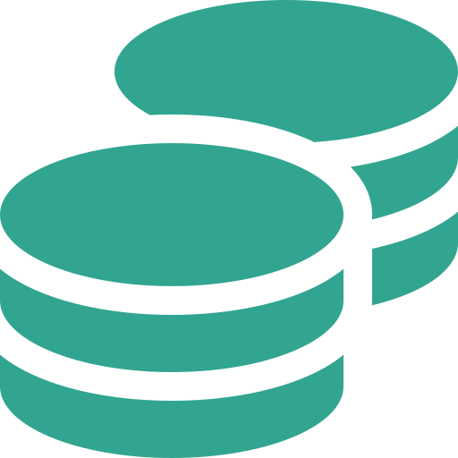

<p align="center">
  <a href="" rel="noopener">
 </a>
</p>

<h3 align="center">My Expertpay</h3>

---

<p align="center"> Few lines describing your project.
    <br> 
</p>

## 📝 Table of Contents

- [About](#about)
- [Getting Started](#getting_started)
- [Deployment](#deployment)
- [Usage](#usage)
- [Built Using](#built_using)
- [TODO](../TODO.md)
- [Contributing](../CONTRIBUTING.md)
- [Authors](#authors)
- [Acknowledgments](#acknowledgement)

## 🧐 About <a name = "about"></a>

Write about 1-2 paragraphs describing the purpose of your project.

## 🏁 Getting Started <a name = "getting_started"></a>

These instructions will get you a copy of the project up and running on your local machine for development and testing purposes. See [deployment](#deployment) for notes on how to deploy the project on a live system.

### Prerequisites

Before you can run this project, you will need to have the following software and tools installed:

- Node.js (version 12 or higher)
- npm (version 6 or higher)

To check if you have Node.js and npm installed, you can run the following commands in your terminal:
  
  ```
  node -v
  npm -v
  ```


### Installing

Run the following command to install the project dependencies:

```
npm install
```

## 🔧 Running the tests <a name = "tests"></a>

```
npm run test
```

## 🎈 Usage <a name="usage"></a>

```
npm start
```

## 🚀 Deployment <a name = "deployment"></a>

```
npm run deploy
```

## ⛏️ Built Using <a name = "built_using"></a>

- [React](https://reactjs.org/) - Web Framework
- [Redux](https://redux.js.org/) - State Management
- [React Router](https://reactrouter.com/) - Routing

```
npm run build
```

## ✍️ Authors <a name = "authors"></a>

- [@sheetstone](https://github.com/sheetstone/myexpertpayts)

